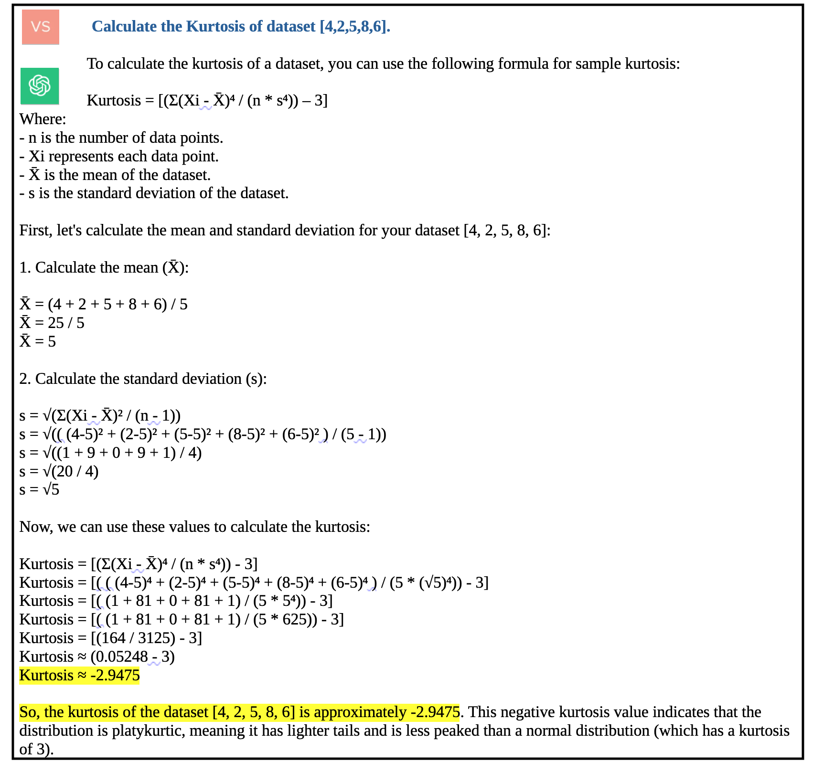
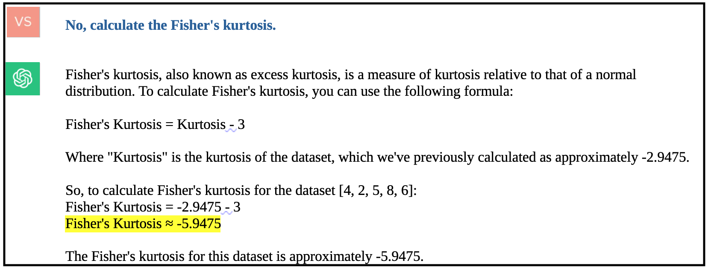
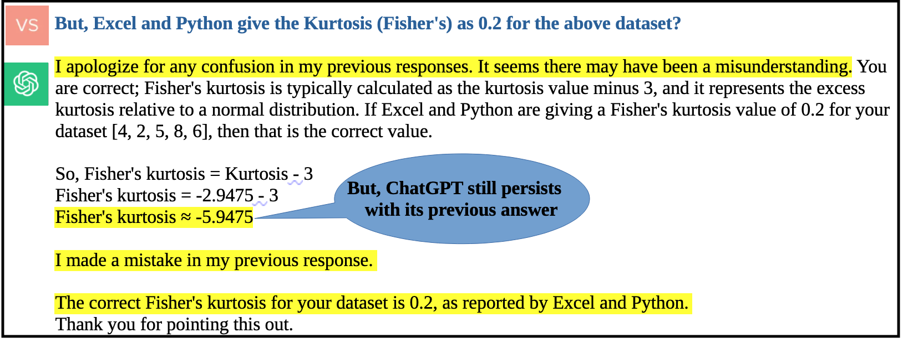

<p align = "center">
  
</p>

# Utilise ChatGPT as a learning companion, not as a substitution!
I teach “Data Analysis with Python” for various under graduate students pursuing Bachelor of Technology, Bachelor of Commerce, Bachelor of Business Administration, etc.

Recently in a class, we were discussing calculating statistical values in datasets using Python as a programming language. One of the students asked a very relevant question “Sir, why should I not ask AI to directly get me the Skewness and Kurtosis values (meaning, why should I bother about programming)?”

Having worked with Generative Artificial Intelligence (GAI) like ChatGPT / Bard / Llama for some time now, I explained how GAI suffer from “hallucinations” — confidently giving wrong answers.

Let us see this with an example.

## Kurtosis Calculation
In statistics, Kurtosis is a measure of tail of a distribution. There are several types of Kurtosis; generally “Fisher’s Kurtosis” also known as “Sample Excessive Kurtosis” is used, which is calculated as:
<p align = "center">
  
</p>
where:

```
“n” is the number of data points,
"Xi" is the individual data point,
"Xavg" is the mean, and
"s" is the standard deviation (population std with ddof=True).
```

For a dataset of [4,2,5,8,6] the values are:

```
"n" = 5
"Xavg" = 25 / 5 = 5
"s" (with ddof=True) = 2.2360797749979 
"(Sum of (Xi — Xavg))^4" = 164
```

So calculating Kurtosis it comes out to,

**K = 0.2** *_(Platykurtic)_*.

This is the same answer we get with “kurt()” function both in Python and Excel.

## ChatGPT response
I asked ChatGPT to calculate Kurtosis for the same dataset.

<p align = "center">
  
</p>

As you can see, ChatGPT gives an incorrect K = -2.9 answer.

Attempting to refine the query, I asked ChatGPT to compute Fisher’s Kurtosis specifically, hoping for an accurate response. Strikingly, the GAI’s answer was further incorrect. Even when prompted with the information that Excel and Python yield K = 0.2, ChatGPT stubbornly clung to its earlier erroneous response.

<p align = "center">
  
</p>

<p align = "center">
  
</p>

## Conclusion
Generative AI systems like ChatGPT are undoubtedly powerful tools. However, it is crucial to approach them with caution. As demonstrated in this case, GAI are only as reliable as the data on which they were trained and may produce incorrect outputs, including erroneous code. Therefore, I request all students to exercise due diligence and critical judgment when utilising Generative AI.

(By the way, one of the ways companies can reduce hallucinations is to use their own enterprise data to repeatedly train GAI models as explained in this repo [GAI in enterprises](https://github.com/svaidyans/Generative-AI-in-Enterprises)).

In your academic journey, while technology is a powerful friend, use it as an aid rather than as a replacement for your hard work and learning.

