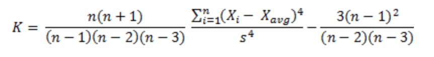

  

# Utilise ChatGPT as a learning companion, not as a substitution!
I teach “Data Analysis with Python” for various under graduate students pursuing Bachelor of Technology, Bachelor of Commerce, Bachelor of Business Administration, etc.

Recently in a class, we were discussing calculating statistical values in datasets using Python as a programming language. One of the students asked a very relevant question “Sir, why should I not ask AI to directly get me the Skewness and Kurtosis values (meaning, why should I bother about programming)?”

Having worked with Generative Artificial Intelligence (GAI) like ChatGPT / Bard / Llama for some time now, I explained how GAI suffer from “hallucinations” — confidently giving wrong answers.

Let us see this with an example.

## Kurtosis Calculation
In statistics, Kurtosis is a measure of tail of a distribution. There are several types of Kurtosis; generally “Fisher’s Kurtosis” also known as “Sample Excessive Kurtosis” is used, which is calculated as:

  

